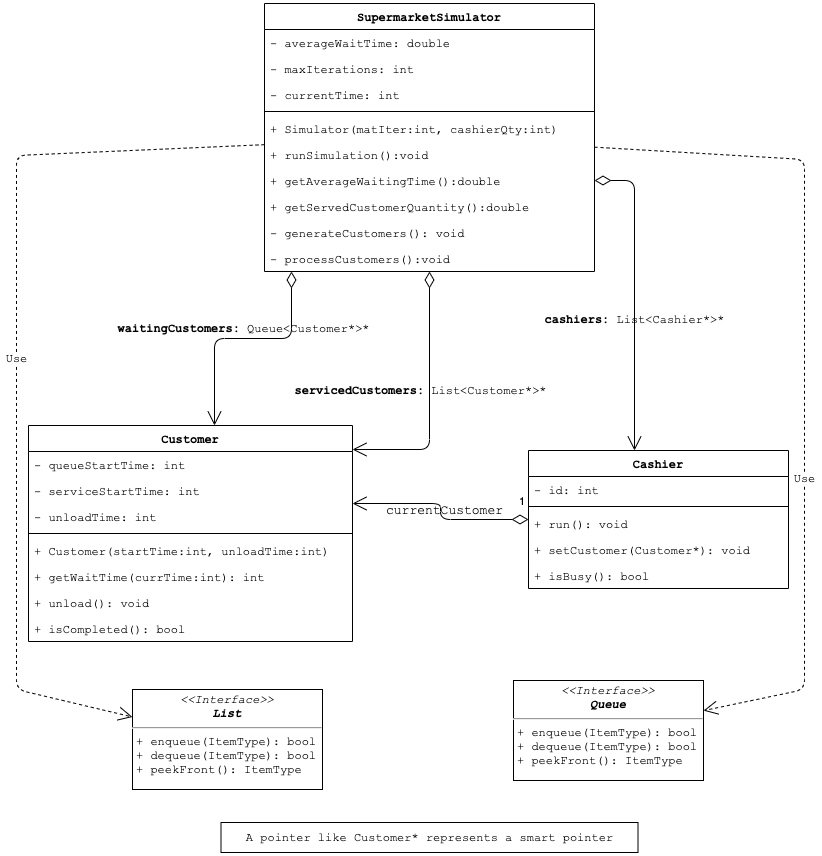
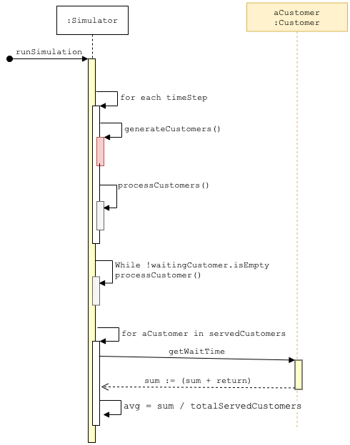
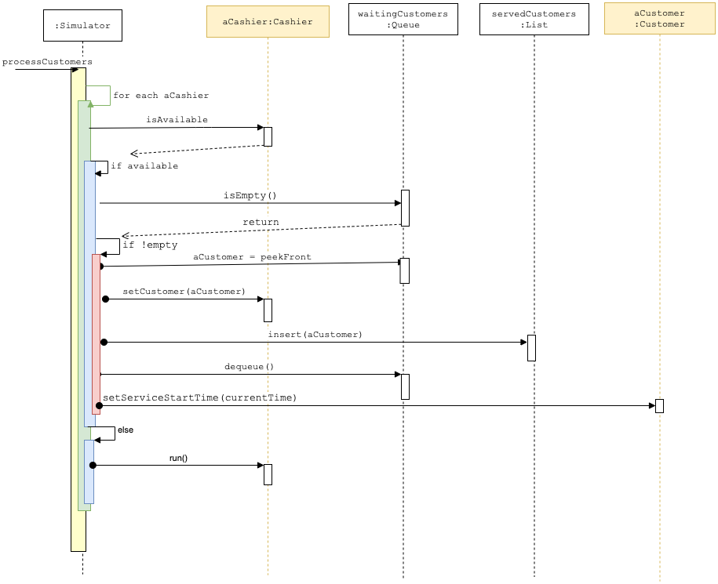

# Laboratory #5 - Using Queues and Lists - Simulation

-----
**CSCI2421 - Summer 2021**

### **_Team Members Names:_**
- Student #1: `Darius Deese`
- Student #2: `Ray Khan`
- Student #3: `_____________`

### **Lab Status**
```text
Describe briefly how complete your lab is, and how did you tested it.
Our code compiles and runs and the simulation loop runs. We ran into an issue with large output numbers for waiting time
however once we ran it in CSEGrid, it fixed itself.

Does it work on CSEGrid?
It does run.
 
## Guidelines:
- Complete your and your teammates' names on the top of this document.
- Open the **TODO tab** on CLION, and complete the implementation.
- **Document your code**, as described on Canvas.
- All team members should be working concurrently using **code-with-me on Clion**.
- If you have questions, use Zoom _"Ask for help button"_ on the toolbar (bottom), and the instructors will get to
   your room asap. You can also use Slack concurrently.
- **Please keep your camera turned on, so you can interact with your team.**
- Instructors will be walking through the rooms regularly.
- Push your solution to GitHub
- Pull your solution from git into CSEGrid
- Compile it and run it on CSEGrid using `make`.
- **Capture a screenshot and save it on your CLion Project folder.**
- Complete the *Lab Status* section on this document.

## TO-DO:
1. Complete the`ListQueue` implementation 
1. Complete the `SupermarkeSimulator` implementation, methods: 
    1. `runSimulation`
    1. `processCustomers`

## Submission
- Complete the lab.
- On CLion execute Build --> Clean from the menu (this will remove all temporary files)
- Using zip, compress the entire CLion Project and upload it to canvas before 11:59am.
    - Remember to add your CSE grid screenshot to your sources folder!
- **LATE SUBMISSIONS**
    - The assignment will be open till 3pm. 
    - Submitting after 11:35:00am will imply a 20% penalty.
    - Submit your lab to your Lab 3 assignment on Canvas. 
- **Extra Credit** -- `50 marks`
    - Add a class `MultiLineSimulator` in which each cashier has its own customer waiting line.
    - Customers cannot change waiting line.
    - Should re-use as much as the code (i.e. do not change `Cashier` or `Customer`)
    - Run the same simulations and discuss the difference on average waiting time. 
    - _Include UML Diagrams_.
    - **SUBMIT TO Lab 5 Extra Credit before Monday, July 12th - 9am** 

## Description
The lab simulates a single queue supermarket where the customers wait in a single line for the first available 
cashier. 
Once the customer is being serviced by the cashier, he/she start unloading their products to the cashier. 
This takes some time. 

The following diagrams document how the system works.
### Class Diagram

### Run Simulation Sequence Diagram

### Process Customers Sequence Diagram


This is a good reference if you want to dive deeper in [sequence diagrams](https://circle.visual-paradigm.com/category/uml-diagrams/sequence-diagram/) 
